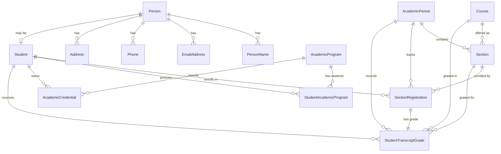

# Entity Relationship Diagram (ERD) Overview

This document provides a high-level view of the Affinity University SIS database schema and its core entities.

## Core Entities

### Person & Contact Information
- **Person** - Core identity record (demographics, birth date, citizenship)
- **PersonName** - Names associated with a person (legal, preferred, etc.)
- **EmailAddress** - Email addresses for a person
- **Phone** - Phone numbers for a person
- **Address** - Physical addresses for a person

### Student Data
- **Student** - Student-specific information linked to a Person
- **StudentAcademicProgram** - Junction table linking Students to Academic Programs
- **AcademicProgram** - Degree programs (majors, minors, certificates)

### Academic Structure
- **AcademicPeriod** - Terms/semesters (Fall 2024, Spring 2025, etc.)
- **Course** - Course catalog definitions
- **Section** - Course delivery instances (specific class offerings)

### Enrollment & Grades
- **SectionRegistration** - Student enrollments in sections
- **StudentTranscriptGrade** - Final grades for completed courses
- **AcademicCredential** - Degrees/awards earned by students

## Entity Relationship Diagram

## Key Relationships

1. **Person → Student**: One-to-One (a Person may be a Student)
2. **Person → Contact Info**: One-to-Many (names, emails, phones, addresses)
3. **Student → SectionRegistration**: One-to-Many (a student can enroll in multiple sections)
4. **Section → SectionRegistration**: One-to-Many (a section can have multiple students)
5. **Student ↔ AcademicProgram**: Many-to-Many via `StudentAcademicProgram` (students can have multiple programs)
6. **SectionRegistration → StudentTranscriptGrade**: One-to-One (each registration has one grade record)

## Data Flow

1. **Person** records are created first (core identity)
2. **Student** records link to Persons when someone becomes a student
3. **AcademicPeriod** records define terms/semesters
4. **Course** records define the catalog
5. **Section** records create specific class offerings for a Course in an AcademicPeriod
6. **SectionRegistration** records enroll Students in Sections
7. **StudentTranscriptGrade** records store final grades for completed registrations
8. **AcademicProgram** and **StudentAcademicProgram** track degree programs
9. **AcademicCredential** records document awarded degrees

